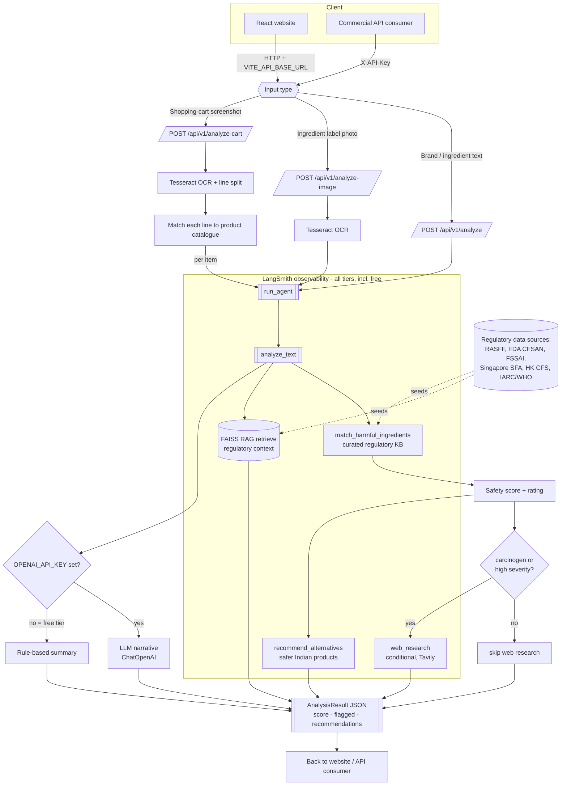

# SafeBasket

> Food-safety intelligence for Indian consumers. SafeBasket scans packaged foods and
> online shopping carts, highlights **harmful and carcinogenic additives** using a RAG
> system grounded in global regulatory databases, and recommends cleaner swaps.

SafeBasket ships in **two modes** that share one agent:

- **Website** — a free, lightweight React app for shoppers (no login).
- **API** — a commercial REST API (`X-API-Key`) for businesses, billed per use.

## Architecture

```
React (Vite) website  ──HTTP──►  FastAPI  ──►  LangChain agent
                                               ├─ FAISS RAG over a curated
                                               │  regulatory knowledge base
                                               │  (RASFF, FDA CFSAN, FSSAI,
                                               │  Singapore SFA, HK CFS, IARC)
                                               ├─ harmful-ingredient matcher
                                               ├─ conditional web research
                                               └─ safer-product recommender
```

The agent first queries the **FAISS RAG** layer for regulatory context, then performs
**conditional web research** when a flagged item is carcinogenic/high-risk. An optional
OpenAI LLM produces a richer consumer narrative; without a key the service falls back to
a fully deterministic rule-based engine so it works offline.

See [`docs/observability.md`](docs/observability.md) to enable **LangSmith** tracing (works
on the free, no-LLM tier too).

## Agent workflow

The highlighted box is the **LangSmith-traced** pipeline — instrumented with `@traceable`
so runs are observable even on the free, no-LLM tier.



A deeper breakdown of the traced spans lives in [`docs/agent-workflow.md`](docs/agent-workflow.md).

## Core capabilities

1. **Analyse by brand or ingredient text** — e.g. `Maggi Masala`, or pasted label text.
2. **Analyse an ingredients-label photo** — OCR (Tesseract) reads the label.
3. **Analyse a shopping-cart screenshot** — Blinkit / Zepto / BigBasket / Amazon / etc.
   OCRs the cart, matches items, flags harmful additives, recommends alternatives.

## Tech stack

- **Agent / API:** Python, FastAPI, LangChain (+ LangSmith tracing), FAISS RAG.
- **Website:** React + Vite (no heavy UI libs).
- **OCR:** Tesseract via `pytesseract`.

## Quick start

### Backend (port 8000)

```bash
cd backend
python3 -m venv .venv && . .venv/bin/activate
pip install -r requirements.txt          # core (offline-capable)
# pip install -r requirements-ml.txt      # optional: sentence-transformers embeddings
uvicorn app.main:app --reload --port 8000
```

API docs at <http://localhost:8000/docs>. All config is optional — see `backend/.env.example`.

### Frontend (port 5173)

> On this **`lovable-deploy`** branch the Vite React app lives at the **repo root**
> (Lovable requires a root-level, non-monorepo Vite app). The Python API stays in
> `backend/` and is deployed separately; the frontend calls it via `VITE_API_BASE_URL`.

```bash
npm install
npm run dev    # proxies /api and /health to the backend on :8000
```

### Tests / lint

```bash
cd backend && . .venv/bin/activate && pytest          # backend tests
npm run lint && npm run build                          # frontend lint + build (repo root)
```

## Deploy to Lovable

This branch is structured for Lovable (root-level Vite app). See [`LOVABLE.md`](LOVABLE.md)
for the step-by-step export workaround, publishing, and custom-domain setup.

## Compliance note

SafeBasket surfaces **public regulatory information** for education. It notes that additives
may be permitted within **FSSAI** limits and never asserts a specific product is unsafe.
It is not medical or legal advice.
