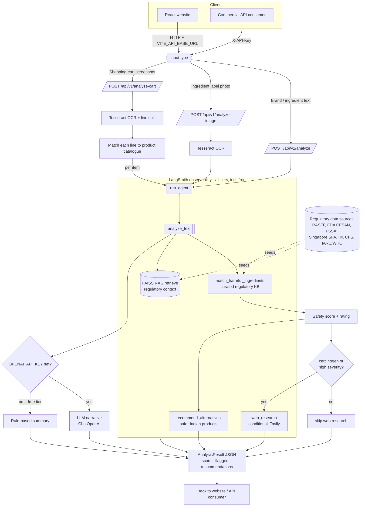

# SafeBasket agent workflow

This is the end-to-end flow of the SafeBasket agent. Every node in the
**LangSmith-traced** subgraph is instrumented with `@traceable`, so each run is
observable in LangSmith — including the **free tier**, which uses the deterministic
rule-based engine and never calls an LLM.

## Traced spans

| Span (`@traceable`)        | Type        | Role |
|----------------------------|-------------|------|
| `safebasket_agent`         | `chain`     | Root run for one analysis request. |
| `analyze`                  | `chain`     | Orchestrates the grounded pipeline. |
| `match_harmful_ingredients`| `tool`      | Matches additives against the knowledge base. |
| `faiss_rag_retrieve`       | `retriever` | FAISS retrieval of regulatory context. |
| `web_research`             | `tool`      | Conditional global recalls/news lookup. |
| `recommend_alternatives`   | `tool`      | Suggests safer Indian products. |

When an OpenAI key is present, the `ChatOpenAI` narrative call is auto-traced by
LangChain and nests under `safebasket_agent` as well.

See `docs/observability.md` for how to turn on LangSmith (free tier).
